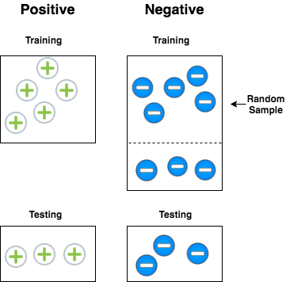
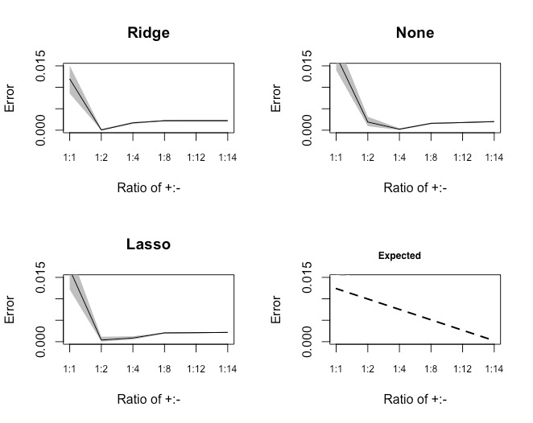
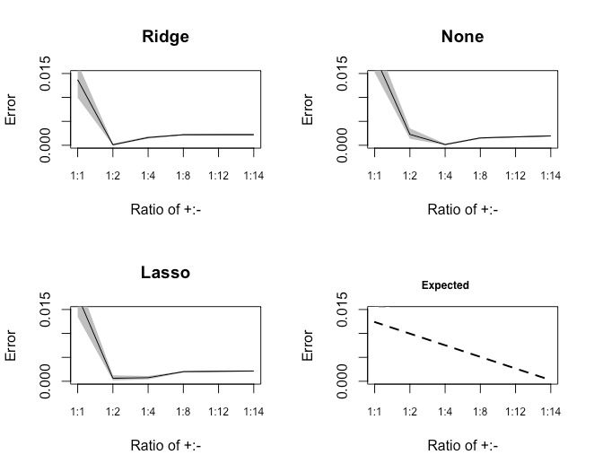
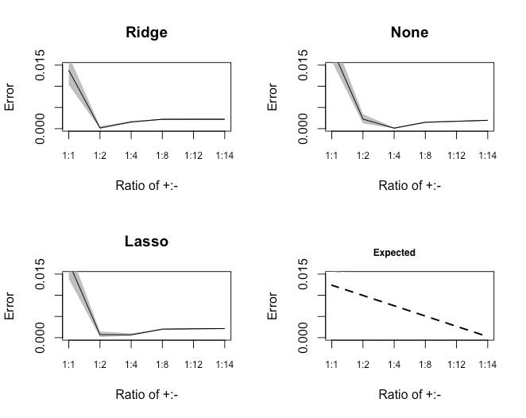
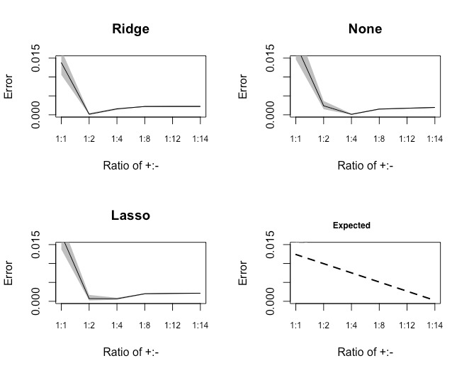

```{r, warning=FALSE, echo=FALSE, message=FALSE}
library(knitr)
library(kableExtra)
library(formattable)
library(dplyr)

#data cleaning for Bianca's part
nhanes0 = read.csv("C:/Users/bdoone/Downloads/nhanes2.csv")
nhanes2 = nhanes0[,c(2,4,5,6,8,11,12,13,15,16,17,18,19,20,21,22,26,28,29,31,32,33,34)]
chd_df = nhanes2[,c(1:11, 15:19, 21:23, 12)]
ha_df = nhanes2[,c(1:11, 15:19, 21:23,13)]
stroke_df = nhanes2[,c(1:11, 15:19, 21:22, 14)]

chd_df$chd = chd_df$chd-1
ha_df$heartattack = ha_df$heartattack-1
stroke_df$stroke = stroke_df$stroke-1

chd_df = chd_df[complete.cases(chd_df),]
ha_df = ha_df[complete.cases(ha_df),]
stroke_df = stroke_df[complete.cases(stroke_df),]
```

#Abstract
_Mention briefly what the study objective is, what the data is like (for example, the sample size, major characteristics of the sample subjects and the key variables included) and what are the statistical methods that you used in the paper. Then, you should focus on summarizing the findings._


#Introduction
_Describe details about how the data set was collected and the variables in the data set. Also describe the scientific questions of interest. Give an overview of how you will address the scientific questions using the appropriate statistical learning methods._

##Common Risk Factors for CHD, Heart Attack, and Stroke
In the table below, you will see the common risk factors for Coronary Heart Disease, Heart Attack, and Stroke. All three outcomes have similar controllable risk factors, specifically high blood pressure, high cholesterol, diabetes, and smoking. It is also important to note that a heart attack results from Coronary Heart Disease, and that Coronary Heart Disease is also a risk factor for stroke.

```{r, echo=FALSE}
chd_risk = c("High Cholesterol",
             "High Blood Pressure",
             "Diabetes",
             "Overweight/Obesity",
             "Smoking",
             "Lack of Physical Activity",
             "Unhealthy Diet",
             "Stress",
             "Age (older)",
             "Gender",
             "Family History",
             "", "", "", "", "")
#https://www.nhlbi.nih.gov/health-topics/coronary-heart-disease

#Note that Heart Attack can result from CHD
ha_risk = c("High Cholesterol",
            "High Blood Pressure",
            "Diabetes",
            "Overweight/Obesity",
            "Smoking",
            "Lack of Physical Activity",
            "Unhealthy Diet",
            "Stress",
            "Age (older)",
            "Gender",
            "Family History",
            "", "", "", "", "")
#https://www.nhlbi.nih.gov/health-topics/heart-attack

#Note that Stroke can result from CHD
stroke_risk = c("High Blood Pressure",
                "Diabetes",
                "Heart Diseases",
                "Smoking",
                "Age (older)",
                "Gender",
                "Race/Ethnicity",
                "Family History",
                "Brain Aneurysms",
                "Alcohol/Drug Use",
                "Lack of Physical Activity",
                "Overweight/Obesity",
                "Stress/Depression",
                "High Cholesterol",
                "Unhealthy Diet",
                "NSAIDs")
#https://www.nhlbi.nih.gov/health-topics/stroke

risk_df = t(rbind(chd_risk, ha_risk, stroke_risk))
colnames(risk_df) = c("CHD", "HeartAttack", "Stroke")

kable(risk_df, caption = "Risk Factors for CHD, Heart Attack, and Stroke")
```


#Methods
_Describe how you used the methods that you learned in class to analyze the data set. Explain why you choose those methods._

##Using Forward/Backward Selection to Find Significant Predictors
We will attempt to determine which predictors are significant for CHD, Heart Attack, and Stroke based on a set of 19 potential predictors: Gender, Race, Education Level, Marital Status, Body Mass Index, Waist Circumference, Pulse Type, Glycated Hemoglobin (used for the diagnosis of diabetes), Total Cholesterol Level, Diabetes, Number of Alcoholic Drunks, Cancer, Moderate Work Activity, Sleep Disorder Status, Smoking Status, Trigycerides, PHQ-9 score, Systolic Blood Pressure, and Diastolic Blood Pressure. We will use Backward Selection and Forward Selection in this part of the analysis, using a logistic regression for all three outcome variables.


```{r, echo=FALSE, eval=FALSE}
#Coronary Heart Disease
chd_full = glm(chd~., data = chd_df, family = binomial)
chd_null = glm(chd~1, data = chd_df, family = binomial)
backward_chd = step(chd_full, k = log(nrow(chd_df)), direction = "backward", trace = 0)
forward_chd = step(chd_null, direction = "forward", k = log(nrow(chd_df)),
                      scope=list(lower=formula(chd_null),upper=formula(chd_full)), trace = 0)
summary(backward_chd)
summary(forward_chd)

###backward: 
#chd ~ marital + bmi + waistcirc + gh + totchol + smoker
#AIC=900.27

###forward: 
#chd ~ marital + totchol + sbp + smoker + gh + gender + drinks
#AIC=909.51
```

```{r, echo=FALSE, eval=FALSE}
#Heart Attack
ha_full = glm(heartattack~., data = ha_df, family = binomial)
ha_null = glm(heartattack~1, data = ha_df, family = binomial)
backward_ha = step(ha_full, k = log(nrow(ha_df)), direction = "backward", trace = 0)
forward_ha = step(ha_null, direction = "forward", k = log(nrow(ha_df)),
                      scope=list(lower=formula(ha_null),upper=formula(ha_full)), trace = 0)

summary(backward_ha)
summary(forward_ha)

###backward: 
#heartattack ~ education + bmi + waistcirc + totchol + drinks + modworkact + sleepdisorder
#AIC: 1052

###forward: 
#heartattack ~ totchol + modworkact + marital + sleepdisorder + sbp + cancer + education
#AIC: 1067.7
```

```{r, echo=FALSE, eval=FALSE}
#Stroke

stroke_full = glm(stroke~., data = stroke_df, family = binomial)
stroke_null = glm(stroke~1, data = stroke_df, family = binomial)
backward_stroke = step(stroke_full, k = log(nrow(stroke_df)), direction = "backward", trace = 0)
forward_stroke = step(stroke_null, direction = "forward", k = log(nrow(stroke_df)),
                      scope=list(lower=formula(stroke_null),upper=formula(stroke_full)), trace = 0)

summary(backward_stroke)
summary(forward_stroke)

###backward: 
#stroke ~ education + bmi + waistcirc + drinks + cancer + phq
#AIC: 804.33

###forward: 
#stroke ~ education + cancer + phq + drinks
#AIC: 814.96
```


#Results and Discussion
_Summarize your analysis results in tables and/or figures. Based on the analysis results, provide conclusions to address the questions of interest. Discuss any limitations of your study._

##Forward Selection vs. Backward Selection

For all three outcome variables, backward selection chose a model with a lower AIC for all 3 outcomes as compared to forward selection.

```{r, echo=FALSE}
nhanes_aic = as.data.frame(matrix(c(900.27, 909.51, 1052.00, 1067.70, 804.3, 814.96), nrow = 3, byrow = T))
colnames(nhanes_aic) = c("Backward", "Forward")
rownames(nhanes_aic) = c("CHD", "Heart Attack", "Stroke")

kable(nhanes_aic, caption = "AIC for Backward and Forward Selection")
```

#Models Selected Through Backward Selection

The table below shows the predictors that were chosen using backward selection for CHD, Heart Attack, and Stroke.

```{r, echo=FALSE}
#marital + bmi + waistcirc + gh + totchol + smoker
chd_results = c("Marital Status",
                "Body Mass Index",
                "Waist Circumference",
                "Glycated Hemoglobin",
                "Total Cholesterol",
                "Smoker","")

#education + bmi + waistcirc + totchol + drinks + modworkact + sleepdisorder
ha_results = c("Education Level",
               "Body Mass Index",
               "Waist Circumference",
               "Total Cholesterol",
               "Number of Alcohol Drinks",
               "Moderate Work Activity",
               "Sleep Disorder")

#education + bmi + waistcirc + drinks + cancer + phq
stroke_results = c("Education Level",
                   "Body Mass Index",
                   "Waist Circumference",
                   "Number of Alcoholic Drinks",
                   "Cancer",
                   "PHQ-9 Score","")

results_df = t(rbind(chd_results, ha_results, stroke_results))

colnames(results_df) = c("CHD (6 Variables)", "Heart Attack (7 Variables)", "Stroke (6 Variables)")

kable(results_df, caption = "Predictors Chosen Using Backward Selection")
```


\begin{table}
\centering
\caption{Predictors Chosen Using Backward Selection}
\label{tab: table1}

\begin{tabular}{|l|l|l|}
\hline
CHD & Heart Attack & Stroke \\
\hline
\textbf{High Cholesterol} & \textbf{High Cholesterol} & High Blood Pressure \\
High Blood Pressure & High Blood Pressure & Diabetes \\
\textbf{Diabetes} & Diabetes & Heart Disease \\
\textbf{Overweight/Obesity} & \textbf{Overweight/Obesity} & Smoking \\
\textbf{Smoking} & Smoking & Age (older) \\
Lack of Physical Activity & \textbf{Lack of Physical Activity} & Gender \\
Unhealthy Diet & Unhealthy Diet & Race/Ethnicity \\
Stress & Stress & Family History \\
Age (older) & Age (older) & Brain Aneurysms \\
Gender & Gender & Alcohol/Drug Use \\
Family History & Family History & Lack of Physical Activity \\
 & & \textbf{Overweight/Obesity} \\
 & & \textbf{Stress/Depression} \\
 & & High Cholesterol \\
 & & Unhealthy Diet \\
 & & NSAIDs \\
\hline

\end{tabular}
\end{table}


Compared to the "Common Risk Factors" stated earlier, backward selection "correctly" selected those in boldface in the table above. Based on these results, it seems that the risk factors that can be controlled have the most significant effect on these outcomes. Across the board, maintaining a healthy weight could lower your risk for all three outcomes. 


# Investigating Class Imbalance

## Introduction 

Due to the rarity of stroke, the NHANES dataset is very imbalanced, with around $4\%$ positives. We seek to answer the question, does applying different penalties provide a predictive advantage at varying levels of class imbalance? The intuition here is that predicting all responses into $1$ class achieves high accuracy when the data set is very imablanced. In particular, we can achieve $99\%$ accuracy on a test set of ninety-nine 1s and one 0 by simply guessing all 1s and ignoring covariates. This is another instance of the commonly found "local minimum" issue in statistical learning. The objective function has such a deep local minimum when guessing all 1s.

In order to address this question, we first take all positive classes (n=743) and randomly sample the negative classes to get datasets with varying ratios of imbalance. Evaluate predictive performance of each model on each dataset using various validation sets in various level of balance $\{(50,50),(25,75),(10,90),(5,95),(1,99)\}$.
 



We adopt the following sample scheme for each validation set run. We first take all positive training examples not in the randomly selected validation set, and then randomly sample negative training classes in a series of ratios $\{(1:1),(1:2),(1:4),(1:8),(1:12),(1:14)\}$. We repeat this procedure 100 times for each ratio in order to get a sense of the variance of the error around the mean. 


## Logistic Regression Results











The first thing to notice is that the regularization methods seem to offer little advantage over unregularized logistic regression in the presence of class imbalance. Regularization does not seem to overcome the local minimum issue. Further work should address other strategies for avoiding this issue. 

The second thing to notice in the above plots is that none of the methods match the expected decrease in error. We expect such a decrease because of our sampling scheme design. As noted above, each time we increase the ratio, we are adding more negative classes, thus increasing the size of the training data. As long as we have a consistent estimator of the true error (which we do here), we would expect the error to decrease as a function of the training set size due to the law of large numbers.

We also notice that when the ratio of the validation set is 1:1, the minimum error for all models is the training set in ratio of 1:1. As we get increasingly imbalanced the regulariation methods seem to have a minimum error at a ratio of 1:2, regardless of the validation set ratio. However, the unregularized model seems to reach a fixed point at 1:4. 

## QDA and LDA


We extend our methodolgy above to the QDA and LDA setting. However, because of the difficulty in implementing regularized qda,lda we simply evaluate the performance of unregularized QDA/LDA in the same sampling scheme described above. 


## Conclusions

We can see from the above experiments that class imbalance dramatically effects the results of classification methods. The literature has identified this as a problem, but a widely accepted solution has not yet been proposed. We suggest an exploratory measure to investigate this problem by generating plots like the above. It remains to be seen if this result holds accross other datasets and other models. 


