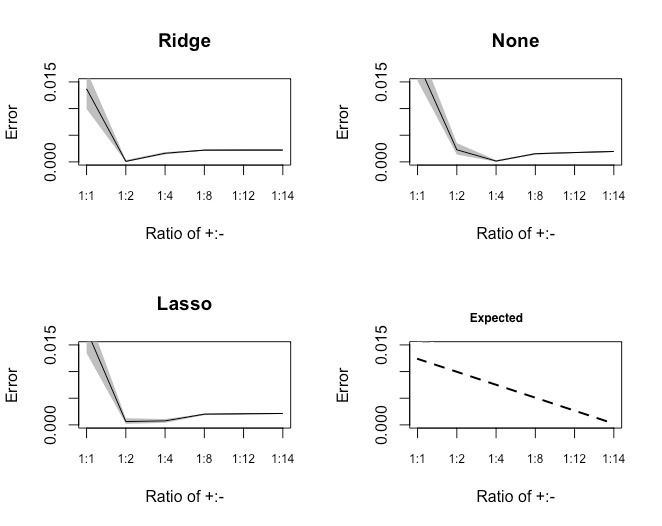
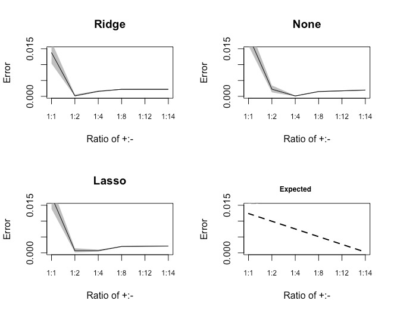

```{r, warning=FALSE, echo=FALSE, message=FALSE}
library(knitr)
library(kableExtra)
library(formattable)
library(dplyr)

#data cleaning for Bianca's part
nhanes0 = read.csv("nhanes2.csv")
nhanes2 = nhanes0[,c(2,4,5,6,8,11,12,13,15,16,17,18,19,20,21,22,26,28,29,31,32,33,34)]
chd_df = nhanes2[,c(1:11, 15:19, 21:23, 12)]
ha_df = nhanes2[,c(1:11, 15:19, 21:23,13)]
stroke_df = nhanes2[,c(1:11, 15:19, 21:22, 14)]

chd_df$chd = chd_df$chd-1
ha_df$heartattack = ha_df$heartattack-1
stroke_df$stroke = stroke_df$stroke-1

chd_df = chd_df[complete.cases(chd_df),]
ha_df = ha_df[complete.cases(ha_df),]
stroke_df = stroke_df[complete.cases(stroke_df),]
```

# Abstract

An analysis of heart disease-related outcomes with a variety of approaches was conducted using data from the CDC's National Health and Examination Survey (NHANES). NHANES waves 2007-2008 to 2013-2014 were used in this work, resulting n a data set consisting 11307 cases and 37 variables, of which 2001 cases were complete. Variables consisted of demographic, dietary, physical examination, laboratory results, and questionnaire responses. This study contains three main avenues of investigation. The first is a study of variable selection techniques in order to asses what factors influence heart disease. We analyze both environmental and genetic factors contributing to stroke, heart disease, and heart attack. The second is a series of prediction expriments to determine the useful of NHANES to the problem of heart disease classification and to study the performance of several classifiers. These classifiers include logistic regression (LR), support vector machines (SVM) with linear, polynomial, and radial kernels, k-nearest neighbors (KNN), and decision trees (DT). The third is a simulation study to assess the impact of the imbalance between positive and negative cases in the data-set. Results from variable selection indicate that controllable risk factors seem to be more influential than uncontrollable ones, with weight being common across all 3 outcomes. Prediction experiment results were generally poor, with many techniques demonstrating little or no sensitivity. KNN performed slightly better than the other methods studied. Finally, results from investigating imbalance show that including all the negative classes may not result in the minimum prediction error. 

# Introduction

Heart disease is the leading cause of death for both men and women. About 1 in 4 deaths are the result of heart disease and about $47\%$ of Americans have at least 1 risk factor. The list of risk factors is long but includes common conditions such as 

- High Blood Pressure
- High Cholesterol
- Diabetes 
- Unhealthy Diet
- Mental Health
- Lack of Exercise 
- Obesity 
- Alcohol
- Smoking
- Genetics \& Family history

Understanding what additional factors effect the prevelance of heart disease is critical in prevention. Building predictive models may help practicing clinicians identify potential sufferers of heart disease, leading to expeditious and effective treatment. In this analysis, we try and tackle both aspects: udnerstanding what covariates influence heart disease, and building models to identify patients at risk.

The data used in this work came from the CDC's National Health and Nutrition Examination Survey (NHANES), which contains a variety of demographic, dietary, physical examination, laboratory results, and survey response variables. NHANES is conducted in two-year waves, with the most recent version of the study having its first two-year wave in 1999-2001. As of this writing, the current wave is 2017-2018 and is still ongoing.

For our work, waves 2007-2008, 2009-2010, 2011-2012, and 2013-2014 were download and joined. These four waves were chosen to facilitate merging datasets, as variable names can differ between waves. Variable naming conventions across the four chosen waves remained consistent for variables of interest to us. The initial import consisted of 11307 cases, with 580 columns.

Several columns in the initial import did not represent variables thought to be related to heart disease. In addition, many columns contained administrative information for the NHANES study and did not represent actual variables. Other columns represented information that needed to be summarized in some fashion. For example, some imported variables were individual items in a scale, such as the items used to compute PHQ-9 score. The PHQ-9 score is a measure of depression level composed of the sum of 9 question responses that each can assume values 0, 1, 2, and 3. Thus, PHQ-9 scores can range from 0 to 27, with higher scores indicating more severe depression. Other columns form the initial import were repeated observations of the same quantity. For example, systolic and diastolic blood pressure was recorded up to four times for individuals. The mean of these measurements was used as the corresponding blood pressure variable in our study. After perform these operations, the number of variables was reduced to 37. Of the 11307 total cases, 2001 were complete.

The three outcomes used in this work were incidence of heart attack, stroke, and coronary heart disease (CHD). These were obtained from the NHANES "Medical Conditions (MCQ)" in which respondents were asked "Has a doctor or other health professional ever told you that you had ..." one of the three conditions. Table 1 summarizes the counts and prevalences of these three conditions in our dataset.

\begin{table}
\caption{Prevalence of Heart Disease-Related Conditions} \label{tab:title}
\begin{center}
\begin{tabular}{lccc}
\toprule
Condition & Count & Total & Prevalence \\
\midrule
Heart Attack & 483 & 10980 & 0.044 \\
Stroke & 420 & 10984 & 0.038 \\
CHD & 447 & 10505 & 0.041 \\
\bottomrule
\end{tabular}
\end{center}
\end{table}

We analyzed these heart disease-related outcomes in three ways. The first was variable selection ...

The second analysis we conducted was a series of prediction experiments using a variety of methods to classify heart disease-related outcomes with NHANES data was conducted. There are two primary goals of this exercise. The first is to see how well NHANES data can be used to classify instance of heart disease-related outcomes such as heart attack, stroke, and coronary heart disease (CHD). The second was to evaluate the performance of classification methods relative to each other and assess if one method significantly outperformed the others. The classification methods used were as follows: logistic regression (LR), with both lasso and ridge penalties; support vector machines (SVM), using linear, polynomial, and radial kernels; k-nearest neighbors (KNN), and; decision trees (DT). 

Finally, the third analysis was a study of the effects of imbalance in levels of the outcome variables. Due to the rarity of stroke, the NHANES data-set is very imbalanced, with around $4\%$ positives. We seek to answer the question, does applying different penalties provide a predictive advantage at varying levels of class imbalance? The intuition here is that predicting all responses into $1$ class achieves high accuracy when the data set is very imbalanced. In particular, we can achieve $99\%$ accuracy on a test set of ninety-nine 1s and one 0 by simply guessing all 1s and ignoring covariates. This is another instance of the commonly found "local minimum" issue in statistical learning. The objective function has such a deep local minimum when guessing all 1s.

In the Methods section, provide an overview of the procedures use for each analysis stream. In the Results and Discussion section, we describe results of our work and discuss conclusions of the research.

\newpage

# Methods

## Using Forward/Backward Selection to Find Significant Predictors

We will attempt to determine which predictors are significant for CHD, Heart Attack, and Stroke based on a set of 19 potential predictors: Gender, Race, Education Level, Marital Status, Body Mass Index, Waist Circumference, Pulse Type, Glycated Hemoglobin (used for the diagnosis of diabetes), Total Cholesterol Level, Diabetes, Number of Alcoholic Drunks, Cancer, Moderate Work Activity, Sleep Disorder Status, Smoking Status, Trigycerides, PHQ-9 score, Systolic Blood Pressure, and Diastolic Blood Pressure. We will use Backward Selection and Forward Selection in this part of the analysis, using a logistic regression for all three outcome variables.

```{r, echo=FALSE, eval=FALSE}
#Coronary Heart Disease
chd_full = glm(chd~., data = chd_df, family = binomial)
chd_null = glm(chd~1, data = chd_df, family = binomial)
backward_chd = step(chd_full, k = log(nrow(chd_df)), direction = "backward", trace = 0)
forward_chd = step(chd_null, direction = "forward", k = log(nrow(chd_df)),
                      scope=list(lower=formula(chd_null),upper=formula(chd_full)), trace = 0)
summary(backward_chd)
summary(forward_chd)

###backward: 
#chd ~ marital + bmi + waistcirc + gh + totchol + smoker
#AIC=900.27

###forward: 
#chd ~ marital + totchol + sbp + smoker + gh + gender + drinks
#AIC=909.51
```

```{r, echo=FALSE, eval=FALSE}
#Heart Attack
ha_full = glm(heartattack~., data = ha_df, family = binomial)
ha_null = glm(heartattack~1, data = ha_df, family = binomial)
backward_ha = step(ha_full, k = log(nrow(ha_df)), direction = "backward", trace = 0)
forward_ha = step(ha_null, direction = "forward", k = log(nrow(ha_df)),
                      scope=list(lower=formula(ha_null),upper=formula(ha_full)), trace = 0)

summary(backward_ha)
summary(forward_ha)

###backward: 
#heartattack ~ education + bmi + waistcirc + totchol + drinks + modworkact + sleepdisorder
#AIC: 1052

###forward: 
#heartattack ~ totchol + modworkact + marital + sleepdisorder + sbp + cancer + education
#AIC: 1067.7
```

```{r, echo=FALSE, eval=FALSE}
#Stroke

stroke_full = glm(stroke~., data = stroke_df, family = binomial)
stroke_null = glm(stroke~1, data = stroke_df, family = binomial)
backward_stroke = step(stroke_full, k = log(nrow(stroke_df)), direction = "backward", trace = 0)
forward_stroke = step(stroke_null, direction = "forward", k = log(nrow(stroke_df)),
                      scope=list(lower=formula(stroke_null),upper=formula(stroke_full)), trace = 0)

summary(backward_stroke)
summary(forward_stroke)

###backward: 
#stroke ~ education + bmi + waistcirc + drinks + cancer + phq
#AIC: 804.33

###forward: 
#stroke ~ education + cancer + phq + drinks
#AIC: 814.96
```

## Prediction Experiments

Prediction experiments used 21 features from the NHANES data set. Continuous features included BMI, height, weight, waist circumference, glycohemoglobin level, HDL/LDL/total cholesterol levels, triglyceride levels, depression levels according to the PHQ-9 diagnostic, and systolic/diastolic blood pressure. Dichotomous features included being male, diabetes status, cancer status, at least 10 min/day of moderate physical activity, light sleeper status, sleep disorder status, at least 100 cigarettes smoked in their lifetime. Ordinal variables included education, age category, and poverty-to-income ratio category. Categorical variables included race and marital status. 

Many of the features had response options of "Don't Know" or "Refused". These were converted to missing values and, after extracting complete cases, resulted in a prediction experiment dataset consisting of 7942 observations. Prevalences for heart attack, stroke, and CHD in this dataset were 4.1%, 3.6%, and 4.0%, respectively. Additionally, a dichotomous heart disease status variable was constructed. This variable was 1 if the respondent had at least one of heart attack, stroke, and CHD conditions. The prevalence for this variable was 8.7%.

To assess classification accuracy, 5-fold cross validation was used. This proceed in the following steps.  First, approximately one-sixth of the cases (n = 1323) were randomly assigned to a test set. On the remaing five-sixths (n = 6619) of cases in the train, 5-fold cross validation was done to determine the set of hyperparameters that resulted in the best classification performance for each method. The R functions `cv.glment` and `tune` were used to implement cross validation for LR and SVM methods, respectively. For KNN, models were fit with the `knn` function and performance was assessed by classification accuracy. For DT, the function `cv.tree` was used to prune a fully grown tree.

For LR, both $L_1$ and $L_2$ penalizations (lasso and ridge, respectively) were used. The relevant hyperparameter for both is regularization constant $\lambda$. Large values for $\lambda$ indicate stronger penalization.

For SVM, the following kernels were employed: linear, polynomial, and radial. For SVM-linear, the hyperparameters that were explored are cost $C$ and slack variable $\epsilon_i$. High values of $C$ and low values of $\epsilon_i$ correspond to stronger regularization. For SVM-poly and SVM-radial, a third hyperparameter $\gamma$ was explored. Small values of gamma indicate stronger regularization.

For KNN, the primary hyperparamter is the number of nearest neighbors, $K$. For DT, the primary hyperparameter is tree-depth $d$. In the case of DT, the `tree` function is used to build the largest possible tree, then `cv.tree` function is used to prune the tree.

Table 2 lists the relevant hyperparameter(s) and the set of hyperparameter searched for each method. Both LR methods use $\lambda$ as their hyperparamter. All three SVM kernels use $C$ and $\epsilon_i$ as hyperparameters, while polynomial and radial kernels use $\gamma$.

\begin{table}
\caption {Hyperparameters for Each Method} \label{tab:title}
\begin{center}
\begin{tabular}{lcl}
\toprule
Method & Hyperparameter & Hyperparameter Values \\
\midrule
LR & $\lambda$ & 0, 0.01, 0.1, 1, 10, 100 \\
SVM & $C$ & 0.01, 0.1, 1, 10 \\
    & $\epsilon_i$ & 0.01, 0.1, 1 \\
SVM-poly, -radial & $\gamma$ & 0.01, 0.1, 1, 10 \\
KNN & $K$ & $1, 2, \dots, 20$ \\
DT & $d$ & performed automatically by `cv.tree` \\
\bottomrule
\end{tabular}
\end{center}
\end{table}

## Investigating Class Imbalance

In order to address this question, we first take all positive classes (n=743) and randomly sample the negative classes to get data-sets with varying ratios of imbalance (Figure 1). Evaluate predictive performance of each model on each data-set using various validation sets in various level of balance $\{(50,50),(25,75),(10,90),(5,95),(1,99)\}$.

We adopt the following sample scheme for each validation set run. We first take all positive training examples not in the randomly selected validation set, and then randomly sample negative training classes in a series of ratios $\{(1:1),(1:2),(1:4),(1:8),(1:12),(1:14)\}$. We repeat this procedure 100 times for each ratio in order to get a sense of the variance of the error around the mean. 

```{r out.width='50%',echo=FALSE,fig.cap="Sampling Scheme",fig.align="center"}
knitr::include_graphics('imgs/sample.jpg')
```

\newpage

# Results and Discussion

## Forward Selection vs. Backward Selection

For all three outcome variables, backward selection chose a model with a lower AIC for all 3 outcomes as compared to forward selection. Results are displayed in Table 3.

```{r, echo=FALSE}
nhanes_aic = as.data.frame(matrix(c(900.27, 909.51, 1052.00, 1067.70, 804.3, 814.96), nrow = 3, byrow = T))
colnames(nhanes_aic) = c("Backward", "Forward")
rownames(nhanes_aic) = c("CHD", "Heart Attack", "Stroke")

kable(nhanes_aic, caption = "AIC for Backward and Forward Selection")
```

### Models Selected Through Backward Selection

Table 4 shows the predictors that were chosen using backward selection for CHD, Heart Attack, and Stroke.

```{r, echo=FALSE}
#marital + bmi + waistcirc + gh + totchol + smoker
chd_results = c("Marital Status",
                "Body Mass Index",
                "Waist Circumference",
                "Glycated Hemoglobin",
                "Total Cholesterol",
                "Smoker","")

#education + bmi + waistcirc + totchol + drinks + modworkact + sleepdisorder
ha_results = c("Education Level",
               "Body Mass Index",
               "Waist Circumference",
               "Total Cholesterol",
               "Number of Alcohol Drinks",
               "Moderate Work Activity",
               "Sleep Disorder")

#education + bmi + waistcirc + drinks + cancer + phq
stroke_results = c("Education Level",
                   "Body Mass Index",
                   "Waist Circumference",
                   "Number of Alcoholic Drinks",
                   "Cancer",
                   "PHQ-9 Score","")

results_df = t(rbind(chd_results, ha_results, stroke_results))

colnames(results_df) = c("CHD (6 Variables)", "Heart Attack (7 Variables)", "Stroke (6 Variables)")

kable(results_df, caption = "Predictors Chosen Using Backward Selection")
```

Compared to the "Common Risk Factors" stated earlier, backward selection "correctly" selected those in boldface in Table 5. Based on these results, it seems that the risk factors that can be controlled have the most significant effect on these outcomes. Across the board, maintaining a healthy weight could lower your risk for all three outcomes.

\begin{table}
\centering
\caption{Predictors Chosen Using Backward Selection}\label{tab: table1}
\begin{tabular}{|l|l|l|}
\hline
CHD & Heart Attack & Stroke \\
\hline
\textbf{High Cholesterol} & \textbf{High Cholesterol} & High Blood Pressure \\
High Blood Pressure & High Blood Pressure & Diabetes \\
\textbf{Diabetes} & Diabetes & Heart Disease \\
\textbf{Overweight/Obesity} & \textbf{Overweight/Obesity} & Smoking \\
\textbf{Smoking} & Smoking & Age (older) \\
Lack of Physical Activity & \textbf{Lack of Physical Activity} & Gender \\
Unhealthy Diet & Unhealthy Diet & Race/Ethnicity \\
Stress & Stress & Family History \\
Age (older) & Age (older) & Brain Aneurysms \\
Gender & Gender & Alcohol/Drug Use \\
Family History & Family History & Lack of Physical Activity \\
 & & \textbf{Overweight/Obesity} \\
 & & \textbf{Stress/Depression} \\
 & & High Cholesterol \\
 & & Unhealthy Diet \\
 & & NSAIDs \\
\hline
\end{tabular}
\end{table}

## Prediction Experiments

Table 6 gives prediction experiment results for each outcome by method. Included are the optimal hyperparameters for each method, as well as classification accuracy, sensitivity, and specificity. For the SVM method, if kernel isn't specified then the listed hyperparameters apply to their particular kernels. For example, for the heart attack outcome, the optimal values of $C$ and $\epsilon_i$ are the same for linear, polynomial, and radial kernels, while the indicated $gamma$ value applies only to polynomial and radial kernels.

Results in general are quite poor. While accuracy is generally high, this is due to the fact that most methods simply didn't classify anyone as having the condition. Since the outcomes of interest are rare, the resulting accuracy is high. Indeed, most methods demonstrate little ability to correctly classify individuals with the condition in question. Only KNN consistently displayed any sort of sensitivity, with 0.083, 0.083, 0.088, and 0.16 for heart attack, stroke, CHD, and heart disease, respectively.

Based on these results, KNN seemed to perform the best. However, as evidenced by its low sensitivities, any advantage it might have over the other methods is marginal. It appears that NHANES data (or at least, the features chosen for this study) are ill-suited to predicting instances of heart disease-related outcomes.

The poor performance of most methods could be explained by the severe class imbalance of the outcomes. When outcome prevalence is very low, classifiers can have difficult making predictions with high sensivity. In these cases, alternative classification metrics such as G-mean and $F$-measure should be used to assess classifier performance (Lin and Chen, 2012). Future work should involve re-analyzing the classification methods using these measures.

\begin{table}
\caption {Prediction Experiment Results} \label{tab:title}
\begin{center}
\begin{tabular}{lllccc}
\toprule
Outcome & Method & Parameter & Accuracy & Sensitivity & Specificity \\
\midrule
Heart Attack & LR-lasso & $\lambda = 100$ & 0.964 & 0.000 & 1.000 \\
             & LR-ridge & $\lambda = 100$ & 0.964 & 0.000 & 1.000 \\
             & SVM & $C = 0.01$ & 0.964 & 0.000 & 1.000 \\
 &              & $\epsilon = 0.01$ & & & \\
 &              & $\gamma = 0.01$ & & & \\
             & KNN & n = 1 & 0.935 & 0.083 & 0.967 \\
             & DT & d = 6 & 0.964 & 0.000 & 1.000 \\
\midrule
Stroke & LR-lasso & $\lambda = 100$ & 0.973 & 0.000 & 1.000 \\
 & LR-ridge & $\lambda = 100$ & 0.973 & 0.000 & 1.000 \\
 & SVM & $C = 0.01$ & 0.973 & 0.000 & 1.000 \\
 &     & $\epsilon = 0.01$ & & & \\
 &     & $\gamma = 0.01$ & & & \\
 & KNN & n = 1 & 0.952 & 0.083 & 0.976 \\
 & DT & d = 5 & 0.973 & 0.000 & 1.000 \\
\midrule
CHD & LR-lasso & $\lambda = 100$ & 0.957 & 0.000 & 1.000 \\
 & LR-ridge & $\lambda = 100$ & 0.957 & 0.018 & 0.999 \\
 & SVM-linear & $C = 0.01$ & 0.957 & 0.000 & 1.000 \\
 &     & $\epsilon = 0.01$ & & & \\
 & SVM-radial & $C = 10$ & 0.955 & 0.018 & 0.998 \\
 &     & $\epsilon = 0.01$ & & & \\
 &     & $\gamma = 0.01$ & & & \\
 & SVM-poly & $C = 1$ & 0.957 & 0.000 & 1.000 \\
 &     & $\epsilon = 0.01$ & & & \\
 &     & $\gamma = 0.01$ & & & \\
 & KNN & n = 1 & 0.931 & 0.088 & 0.968 \\
 & DT & d = 6 & 0.964 & 0.000 & 1.000 \\
 \midrule
Heart Disease & LR-lasso & $\lambda = 0$ & 0.921 & 0.009 & 1.000 \\
 & LR-ridge & $\lambda = 0.1$ & 0.920 & 0.028 & 0.998 \\
 & SVM-linear & $C = 0.01$ & 0.920 & 0.000 & 1.000 \\
 &     & $\epsilon = 0.01$ & & & \\
 & SVM-radial & $C = 1$ & 0.918 & 0.009 & 0.998 \\
 &     & $\epsilon = 0.01$ & & & \\
 &     & $\gamma = 0.10$ & & & \\
 & SVM-poly & $C = 1$ & 0.920 & 0.000 & 1.000 \\
 &     & $\epsilon = 0.01$ & & & \\
 &     & $\gamma = 0.01$ & & & \\
 & KNN & n = 1 & 0.876 & 0.160 & 0.938 \\
 & DT & d = 5 & 0.920 & 0.000 & 1.000\\
\bottomrule
\end{tabular}
\end{center}
\end{table}

\newpage

## Investigating Class Imbalance 


### Logistic Regression Results

```{r,eval=FALSE,echo=FALSE,message=FALSE}
library(glmnet)
library(caret)
library(rstanarm)
## We need an outer for loop

for (val_size in 1:5){
  num_sims <- 100
  nprops <- 6
  lr_lasso_mse_results_matrix <- matrix(NA,nrow=num_sims,ncol=nprops)
  lr_ridge_mse_results_matrix <- matrix(NA,nrow=num_sims,ncol=nprops)
  lr_none_mse_results_matrix <- matrix(NA,nrow=num_sims,ncol=nprops)
  lr_bayes_results_matrix <- matrix(NA,nrow=num_sims,ncol=nprops)
  
  row_count <- 1
  
  pos <- nhanes2[nhanes2$stroke == 1,]
  neg <- nhanes2[nhanes2$stroke == 2,]
  
  ### maintain validation set test size at 100
  if (val_size == 1){
    pos_test_index <- sample(1:100,50)
    neg_test_index <- setdiff(1:100,pos_test_index)
  }
  
  if (val_size == 2){
    pos_test_index <- sample(1:100,25)
    neg_test_index <- setdiff(1:100,pos_test_index)
  }
    
  if (val_size == 3){
    pos_test_index <- sample(1:100,10)
    neg_test_index <- setdiff(1:100,pos_test_index)
  }
  if (val_size == 4){
    pos_test_index <- sample(1:100,5)
    neg_test_index <- setdiff(1:100,pos_test_index)
  }
  
  if (val_size == 5){
    pos_test_index <- sample(1:100,1)
    neg_test_index <- setdiff(1:100,pos_test_index)
  }
  pos_train_index <- setdiff(1:nrow(pos),pos_test_index)
    neg_train_index <- setdiff(1:nrow(neg),neg_test_index)
    

    pos_test  <- pos[pos_test_index,]
    neg_test <- neg[neg_test_index,]
    
    pos  <- pos[pos_train_index,]
    neg <- neg[neg_train_index,]
    
    test_data <- rbind(pos_test,neg_test)
  
  for (num_sim in 1:num_sims){
    colIndex <- 1
    for (i in c(1,2,4,8,10,14)){
    
    
      ### Get all positive and negative classes
      
      ### start with 1/2 class balance 
      neg_sample <- neg[sample(nrow(neg), i*nrow(pos)), ]
      
      nhanes3 <- rbind(pos,neg_sample)
      nhanes3 <- nhanes3[sample(nrow(nhanes3)),]
      
      
      #Perform 10 fold cross validation
        # Segment data for cross validation
        trainData <- nhanes3
        x_train <- trainData[ , ! colnames(trainData) %in% c("seqn","stroke") ]
        y_train <- trainData[,colnames(trainData) %in% c("stroke") ]
        x_test <- testData[ , ! colnames(testData) %in% c("seqn","stroke") ]
        y_test <- testData[,colnames(trainData) %in% c("stroke") ]
        
        #get data into correct format
        x_train <- data.matrix(x_train)
        y_train <- data.matrix(y_train) -1
        
        x_test <- data.matrix(x_test)
        y_test <- data.matrix(y_test)-1
        
        x_train[is.na(x_train)] <- 0
        y_train[is.na(y_train)] <- 0
        
        x_test[is.na(x_test)] <- 0
        y_test[is.na(y_test)] <- 0 
        
        df_train <- data.frame(x_train=x_train,y_train=y_train)
        df_test <- data.frame(x_train = x_test, y_train = y_test)
        
        cv.lasso <- cv.glmnet(x_train, y_train, alpha = 1, family = "binomial")
        logistic_regression_lasso_penalty_preds <- round(predict(cv.lasso,x_test,type="response"))
        
        model <- glm (stroke ~ ., data = df_train, family = binomial)
        logistic_regression_no_penalty_preds <- round(predict(model,df_test, type = 'response'))
        
        cv.ridge <- cv.glmnet(x_train, y_train, alpha = 0, family = "binomial")
        logistic_regression_ridge_penalty_preds <- round(predict(cv.ridge,x_test,type="response"))
        
       # t_prior <- student_t(df = 7, location = 0, scale = 2.5)
       # post1 <- stan_glm(stroke ~ ., data = df_train,
        #                 family = binomial(link = "logit"), 
         #                 prior = t_prior, prior_intercept = t_prior,
          #                seed = 1)
        
        
       # ppd <- posterior_predict(post1,newdata=df_test,type="response")
        #bayesian_logistic_regression_preds <- round(colMeans(ppd))
        
        lr_none_mse_results_matrix[num_sim,colIndex] <- mean(logistic_regression_no_penalty_preds-y_test)^2
        lr_ridge_mse_results_matrix[num_sim,colIndex] <- mean(logistic_regression_ridge_penalty_preds-y_test)^2
       # lr_bayes_results_matrix[row_count,j] <- mean(bayesian_logistic_regression_preds-y_test)^2
        lr_lasso_mse_results_matrix[num_sim,colIndex] <- mean(logistic_regression_lasso_penalty_preds-y_test)^2
        
      
      #plot.roc(as.numeric(y_test),as.numeric(logistic_regression_no_penalty_preds),percent=TRUE,col="#1c61b6",  print.auc=TRUE)
      #plot.roc(as.numeric(y_test),as.numeric(logistic_regression_ridge_penalty_preds),percent=TRUE,col="#1c61b6",  print.auc=TRUE)
      #plot.roc(as.numeric(y_test),as.numeric(logistic_regression_lasso_penalty_preds),percent=TRUE,col="#1c61b6",  print.auc=TRUE)
    #  plot.roc(as.numeric(y_test),as.numeric(bayesian_logistic_regression_preds),percent=TRUE,col="#1c61b6",  print.auc=TRUE)
      colIndex <- colIndex + 1
    }
  }
  
  
  fullLassoLr <- colMeans(lr_lasso_mse_results_matrix)
  fullRidgeLr <- colMeans(lr_ridge_mse_results_matrix)
  fullBayesLr <- colMeans(lr_none_mse_results_matrix)
  fullNoneLr <- colMeans(lr_none_mse_results_matrix)
  
  library(matrixStats)
  ciLassoLr <- colQuantiles(lr_lasso_mse_results_matrix,probs=c(.025,.975))
  ciRidgeLr <- colQuantiles(lr_ridge_mse_results_matrix,probs=c(.025,.975))
  ciBayesLr <- colQuantiles(lr_none_mse_results_matrix,probs=c(.025,.975))
  ciNoneLr <- colQuantiles(lr_none_mse_results_matrix,probs=c(.025,.975))
  
  
  plot(fullRidgeLr,type='l',ylim=c(0,.015),col="black",xaxt = "n",xlab="Ratio of +:-",ylab="Error",main="Ridge")
  axis(1, at=1:nprops,cex.axis=.75, labels=c("1:1","1:2","1:4","1:8","1:12","1:14"))
  polygon(c(1:nprops,rev(1:nprops)),c(ciRidgeLr[,1],rev(ciRidgeLr[,2])),col = "grey75", border = FALSE)
  lines(1:nprops,fullRidgeLr)
  
  
  plot(fullLassoLr,type='l',ylim=c(0,.015),col="black",xaxt = "n",xlab="Ratio of +:-",ylab="Error",main="Lasso")
  axis(1, at=1:nprops,cex.axis=.75, labels=c("1:1","1:2","1:4","1:8","1:12","1:14"))
  polygon(c(1:nprops,rev(1:nprops)),c(ciLassoLr[,1],rev(ciLassoLr[,2])),col = "grey75", border = FALSE)
  lines(1:nprops,fullLassoLr)
  
  plot(fullNoneLr,type='l',ylim=c(0,.015),col="black",xaxt = "n",xlab="Ratio of +:-",ylab="Error",main="None")
  axis(1, at=1:nprops,cex.axis=.75,labels=c("1:1","1:2","1:4","1:8","1:12","1:14"))
  polygon(c(1:nprops,rev(1:nprops)),c(ciNoneLr[,1],rev(ciNoneLr[,2])),col = "grey75", border = FALSE)
  lines(1:nprops,fullNoneLr)
}
```


```{r out.width='70%',echo=FALSE,fig.cap="(50,50) Validation Split",fig.align="center"}
knitr::include_graphics('imgs/val_1_total.jpeg')

```

```{r out.width='70%',echo=FALSE,fig.cap="(25,75) Validation Split",fig.align="center"}
knitr::include_graphics('imgs/val_2_total.jpeg')
```

```{r out.width='70%',echo=FALSE,fig.cap="(10,90) Validation Split",fig.align="center"}

```

```{r out.width='70%',echo=FALSE,fig.cap="(5,95) Validation Split",fig.align="center"}

```

```{r out.width='70%',echo=FALSE,fig.cap="(1,99) Validation Split",fig.align="center"}
knitr::include_graphics('imgs/val_5_total.jpeg')
```

The first thing to notice is that the regularization methods seem to offer little advantage over unregularized logistic regression in the presence of class imbalance. Regularization does not seem to overcome the local minimum issue. Further work should address other strategies for avoiding this issue. 

The second thing to notice in the above plots is that none of the methods match the expected decrease in error. We expect such a decrease because of our sampling scheme design. As noted above, each time we increase the ratio, we are adding more negative classes, thus increasing the size of the training data. As long as we have a consistent estimator of the true error (which we do here), we would expect the error to decrease as a function of the training set size due to the law of large numbers.

We also notice that when the ratio of the validation set is 1:1, the minimum error for all models is the training set in ratio of 1:1. As we get increasingly imbalanced the regularization methods seem to have a minimum error at a ratio of 1:2, regardless of the validation set ratio. However, the unregularized model seems to reach a fixed point at 1:4.

### QDA and LDA

We extend our methodology above to the QDA and LDA setting. However, because of the difficulty in implementing regularized qda,lda we simply evaluate the performance of unregularized QDA/LDA in the same sampling scheme described above. 

```{r,echo=FALSE,message=FALSE,eval=FALSE}
library(glmnet)
library(caret)
library(rstanarm)
## We need an outer for loop

for (val_size in 1:5){
  num_sims <- 100
  nprops <- 6
  qda_mse_results_matrix <- matrix(NA,nrow=num_sims,ncol=nprops)
  lda_mse_results_matrix <- matrix(NA,nrow=num_sims,ncol=nprops)

  row_count <- 1
  
  pos <- nhanes2[nhanes2$stroke == 1,]
  neg <- nhanes2[nhanes2$stroke == 2,]
  
  ### maintain validation set test size at 100
  if (val_size == 1){
    pos_test_index <- sample(1:100,50)
    neg_test_index <- setdiff(1:100,pos_test_index)
  }
  
  if (val_size == 2){
    pos_test_index <- sample(1:100,25)
    neg_test_index <- setdiff(1:100,pos_test_index)
  }
  
  if (val_size == 3){
    pos_test_index <- sample(1:100,10)
    neg_test_index <- setdiff(1:100,pos_test_index)
  }
  if (val_size == 4){
    pos_test_index <- sample(1:100,5)
    neg_test_index <- setdiff(1:100,pos_test_index)
  }
  
  if (val_size == 5){
    pos_test_index <- sample(1:100,1)
    neg_test_index <- setdiff(1:100,pos_test_index)
  }
  pos_train_index <- setdiff(1:nrow(pos),pos_test_index)
  neg_train_index <- setdiff(1:nrow(neg),neg_test_index)
  
  
  pos_test  <- pos[pos_test_index,]
  neg_test <- neg[neg_test_index,]
  
  pos  <- pos[pos_train_index,]
  neg <- neg[neg_train_index,]
  
  test_data <- rbind(pos_test,neg_test)
  
  for (num_sim in 1:num_sims){
    colIndex <- 1
    for (i in c(1,2,4,8,10,14)){
      
      
      ### Get all positive and negative classes
      
      ### start with 1/2 class balance 
      neg_sample <- neg[sample(nrow(neg), i*nrow(pos)), ]
      
      nhanes3 <- rbind(pos,neg_sample)
      nhanes3 <- nhanes3[sample(nrow(nhanes3)),]
      
      
      #Perform 10 fold cross validation
      # Segment data for cross validation
      trainData <- nhanes3
      x_train <- trainData[ , ! colnames(trainData) %in% c("seqn","stroke") ]
      y_train <- trainData[,colnames(trainData) %in% c("stroke") ]
      x_test <- testData[ , ! colnames(testData) %in% c("seqn","stroke") ]
      y_test <- testData[,colnames(trainData) %in% c("stroke") ]
      
      #get data into correct format
      x_train <- data.matrix(x_train)
      y_train <- data.matrix(y_train) -1
      
      x_test <- data.matrix(x_test)
      y_test <- data.matrix(y_test)-1
      
      x_train[is.na(x_train)] <- 0
      y_train[is.na(y_train)] <- 0
      
      x_test[is.na(x_test)] <- 0
      y_test[is.na(y_test)] <- 0 
      
      df_train <- data.frame(x_train=x_train,y_train=y_train)
      df_test <- data.frame(x_train = x_test, y_train = y_test)
      
      lda.model = lda (stroke ~., data=df_train)
      predmodel.train.lda = predict(lda.model, newdata=df_test)
      
      qda.model = qda (stroke ~., data=df_train)
      predmodel.train.qda = predict(qda.model, newdata=df_test)
      
      lda_mse_results_matrix[num_sim,colIndex] <- mean((df_test$stroke-as.numeric(predmodel.train.lda$class)-1)^2)
      qda_mse_results_matrix[num_sim,colIndex] <- mean((df_test$stroke-as.numeric(predmodel.train.qda$class)-1)^2)
      
      colIndex <- colIndex + 1
    }
  }
  
  
  fullLda <- colMeans(lda_mse_results_matrix)
  fullQda <- colMeans(qda_mse_results_matrix)

  
  library(matrixStats)
  ciLda <- colQuantiles(lda_mse_results_matrix,probs=c(.025,.975))
  ciQda <- colQuantiles(qda_mse_results_matrix,probs=c(.025,.975))

  
  plot(fullLda,type='l',col="black",xaxt = "n",xlab="Ratio of +:-",ylab="Error",main="LDA")
  axis(1, at=1:nprops,cex.axis=.75, labels=c("1:1","1:2","1:4","1:8","1:12","1:14"))
  polygon(c(1:nprops,rev(1:nprops)),c(ciLda[,1],rev(ciLda[,2])),col = "grey75", border = FALSE)
  lines(1:nprops,fullLda)
  
  
  plot(fullQda,type='l',col="black",xaxt = "n",xlab="Ratio of +:-",ylab="Error",main="QDA")
  axis(1, at=1:nprops,cex.axis=.75, labels=c("1:1","1:2","1:4","1:8","1:12","1:14"))
  polygon(c(1:nprops,rev(1:nprops)),c(ciQda[,1],rev(ciQda[,2])),col = "grey75", border = FALSE)
  lines(1:nprops,fullQda)
  
  
}
```


```{r out.width='65%',echo=FALSE,fig.cap="(50,50) Validation Split",fig.align="center"}


```


```{r out.width='70%',echo=FALSE,fig.cap="(10,90) Validation Split",fig.align="center"}


``` 

```{r out.width='70%',echo=FALSE,fig.cap="(5,95) Validation Split",fig.align="center"}


``` 

Interestingly, the results are even more extreme in the case of QDA/LDA. Not only is the average error higher (as we can tell from the scale on the y-axis), the results steadily get worse as the ratio increases.  

We can see from the above experiments that class imbalance dramatically effects the results of classification methods. The literature has identified this as a problem, but a widely accepted solution has not yet been proposed. We suggest an exploratory measure to investigate this problem by generating plots like the above. It remains to be seen if this result holds across other data-sets and other models. 

# Conclusion

NHANES is a valuable data-set with many covariates and outcomes of interest. Although the data-set is not without issues, we were able to extract some interesting information on risk factors of heart disease. Our analysis of variable selection revealed that among our three outcomes of interest (heart attack, stroke, chd), subject's weight seems to be the most influential. Unfortunately, our predictive models based on 37 potential covariates were relatively unsuccessful because of the high level of class imbalance. We further investigated the robustness of our methods to the imbalanced data-set, which allowed for improved predictions. 

# References 

"Coronary Heart Disease." National Heart Lung and Blood Institute, U.S. Department of Health and Human Services, www.nhlbi.nih.gov/health-topics/coronary-heart-disease.

"Division for Heart Disease and Stroke Prevention." Centers for Disease Control and Prevention, Centers for Disease Control and Prevention, 23 Aug. 2017, www.cdc.gov/dhdsp/data_statistics/fact_sheets/fs_heart_disease.htm.

"Heart Attack." National Heart Lung and Blood Institute, U.S. Department of Health and Human Services, www.nhlbi.nih.gov/health-topics/heart-attack.

"Heart Disease Risk Factors." Centers for Disease Control and Prevention, Centers for Disease Control and Prevention, 10 Aug. 2015, www.cdc.gov/heartdisease/risk_factors.htm.

Lin W, Chen JJ. Class-imbalanced classifiers for high-dimensional data. Brief Bioinform. 2013;14(1),13-26.

"Risk Factors." World Heart Federation, www.world-heart-federation.org/resources/risk-factors/.

"Stroke." National Heart Lung and Blood Institute, U.S. Department of Health and Human Services, www.nhlbi.nih.gov/health-topics/stroke.


